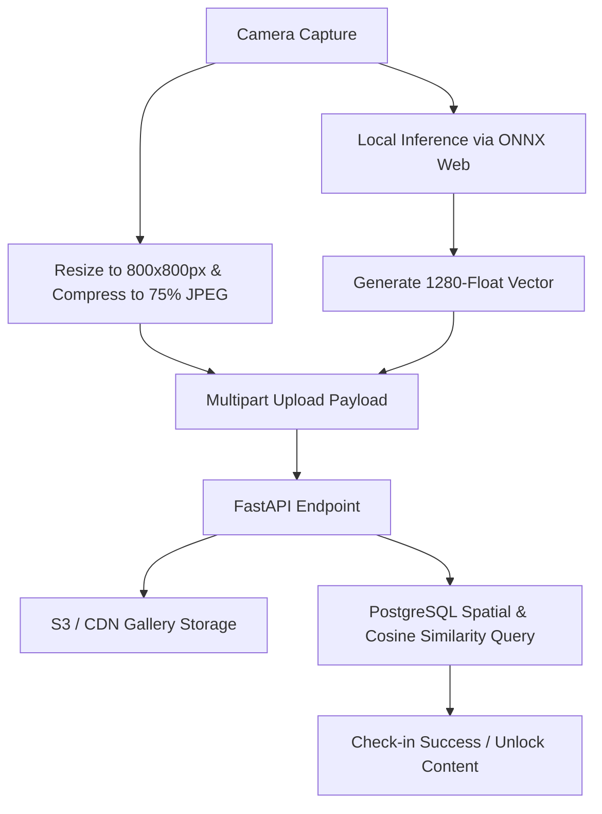

# Foundational Design Document: Image Recognition & Validation Pipeline

This document defines the architectural specifications, decision records (ADRs), schemas, and workflows for the **Novias del Gato** PWA image validation and check-in system. It serves as the primary technical specification for both client-side and server-side implementation.

---

## 1. Executive Summary & Core Design

The visual check-in feature allows explorers to "capture" Cali's cat sculptures by photographing them. To meet the constraints of an **unfunded MVP** (minimizing cloud server costs) while ensuring a **reliable user experience** in public areas with unstable cellular networks, the project uses the **"Compressed Edge" Model**.

### Core Invariant
Vector embedding generation is offloaded entirely to the client device via WebAssembly/WebGL. The server processes no tensor mathematics on check-ins, operating purely as a lightweight router performing geographic proximity checks (PostGIS) and float similarity queries (`pgvector`).



---

## 2. Architectural Decision Records (ADRs)

### ADR-001: Edge Inference with Quantized MobileNetV2
* **Context:** Running deep-learning vision models on the server requires high memory (1GB+ RAM) and CPU cores, raising hosting costs to $20-$40/month.
* **Decision:** We use a pre-trained **MobileNetV2** (ImageNet weights) with its final classification head removed, quantized to 8-bit integers (`int8`) to shrink the weight file from 13MB to **~3.5MB**. The PWA executes this model locally in the browser via [ONNX Runtime Web](https://onnxruntime.ai/docs/tutorials/web/).
* **Rationale:** Offloads heavy mathematical operations from the server to the client's local GPU/CPU. The API can run on a micro $4/month VPS with a minimal RAM footprint (~80MB idle).

### ADR-002: Client-Side Image Pre-Processing & Compression
* **Context:** Sending raw 2MB–5MB phone photographs over congested cellular networks in public parks leads to high upload latency, packet loss, and check-in timeouts.
* **Decision:** Before transmitting the data, the PWA draws the captured image to an offscreen HTML5 `<canvas>`, resizes it to a maximum bounding box of `800x800` pixels, and compresses it to a `75% quality JPEG`.
* **Rationale:** Reduces the network image payload size from **~5MB to ~80KB** (a ~98% reduction) while preserving sufficient quality for the explorer's personal photo gallery.

### ADR-003: API-Driven Versioning for Model Upgrades
* **Context:** If the feature extraction model is upgraded in the future, the dimensions of the generated vectors may change (e.g., from 1280 to 512 dimensions), rendering existing database vectors incompatible.
* **Decision:** Rather than adding a blocking, dynamic network `/config` request on app startup, the model version is hardcoded in the PWA client code. If the model is upgraded, a new client is released targeting a versioned API endpoint (e.g., `POST /v2/sculptures/{id}/check-in`).
* **Rationale:** Simplifies client logic, prevents blocking network calls on startup, and uses standard, predictable backend routing to manage different vector tables or columns.

### ADR-004: Asynchronous Moderation Queue for Device Failures
* **Context:** Some older or budget smartphones may throw exceptions when attempting WebAssembly compilation or WebGL initialization, preventing local vector generation.
* **Decision:** If the PWA catches an ONNX initialization error, it degrades gracefully by falling back to an **Asynchronous Moderation Queue**. It uploads the raw GPS coordinates and the compressed photo to the `/reports` endpoint. The check-in is set to "Pending" until an admin manually approves it.
* **Rationale:** Protects the server from loading resource-heavy inference engines (like PyTorch or full onnxruntime) on the backend, maintaining strict memory limits while still ensuring all users can complete check-ins.

### ADR-005: Progressive Dataset Rollout via Admin Seeding Tool
* **Context:** Collecting, photographing, and seeding reference vectors for all 38 cats on day one is a bottleneck that delays MVP deployment.
* **Decision:** We treat the database as a **Retrieval Engine** rather than a Classifier. We will build a hidden "Admin Check-in" view in the PWA. Using this view, the administrator walks up to a cat on site, photographs it to calculate the 1280-dimension vector locally, and inserts it directly into the database.
* **Rationale:** We can launch the MVP with only 3 cats in the database. New sculptures can be added progressively via database `INSERT` commands without updating the frontend bundle, modifying the backend codebase, or retraining neural networks.

### ADR-006: Acceptance of Offline Sync without Anti-Cheat
* **Context:** PWA clients cannot use hardware-based application attestation, meaning malicious users could spoof GPS coordinates or vector payloads in offline queues (IndexedDB).
* **Decision:** We accept offline check-in payloads at sync time without complex cryptographic or velocity-based anti-cheat algorithms. We reserve the `trust_score` and reputation checks strictly for the crowdsourced location reports (`/reports`).
* **Rationale:** The MVP is a non-monetary, educational cultural game. Prioritizing developer velocity over complex game anti-cheat structures allows faster market validation.

---

## 3. Data Schemas & API Contracts

### Database Schema (SQL)
We store the reference vectors using the `pgvector` extension and the physical locations using the `postgis` extension.

```sql
-- Ensure extensions are loaded
CREATE EXTENSION IF NOT EXISTS postgis;
CREATE EXTENSION IF NOT EXISTS vector;

-- Sculptures table storing baseline vectors
CREATE TABLE sculptures (
    id UUID PRIMARY KEY DEFAULT gen_random_uuid(),
    name VARCHAR(255) NOT NULL,
    description TEXT,
    location GEOGRAPHY(Point, 4326) NOT NULL, -- Spatial coordinates (SRID 4326)
    embedding vector(1280) NOT NULL,         -- L2-Normalized MobileNetV2 embedding vector
    created_at TIMESTAMP WITH TIME ZONE DEFAULT CURRENT_TIMESTAMP
);

-- Check-in Records table (Explorer's Gallery)
CREATE TABLE check_ins (
    id UUID PRIMARY KEY DEFAULT gen_random_uuid(),
    user_id UUID NOT NULL,
    sculpture_id UUID REFERENCES sculptures(id),
    captured_at TIMESTAMP WITH TIME ZONE NOT NULL,
    photo_url VARCHAR(512) NOT NULL,          -- URL pointing to the compressed 80KB photo
    similarity_score FLOAT NOT NULL,          -- The cosine distance calculated at check-in
    created_at TIMESTAMP WITH TIME ZONE DEFAULT CURRENT_TIMESTAMP
);

-- Create a spatial index for fast proximity queries
CREATE INDEX idx_sculptures_location ON sculptures USING GIST (location);

-- Create an HNSW index for fast vector cosine similarity search
CREATE INDEX idx_sculptures_embedding ON sculptures USING hnsw (embedding vector_cosine_ops);
```

### API Endpoint (OpenAPI Fragment)
The check-in endpoint accepts a `multipart/form-data` request containing the coordinates, the photo file, and the float array.

```yaml
/sculptures/{id}/check-in:
  post:
    summary: Capture / Check-in to a Sculpture
    description: |
      Validate proximity and visual match. The PWA calculates the image vector 
      locally and compresses the image to ~80KB before sending.
    operationId: checkInSculpture
    parameters:
      - name: id
        in: path
        required: true
        schema:
          type: string
          format: uuid
    requestBody:
      required: true
      content:
        multipart/form-data:
          schema:
            type: object
            required:
              - photo
              - latitude
              - longitude
              - embedding
            properties:
              photo:
                type: string
                format: binary
                description: Compressed sighting image file (JPEG/PNG, max 800x800px, 75% quality).
              latitude:
                type: number
                format: float
                minimum: -90
                maximum: 90
              longitude:
                type: number
                format: float
                minimum: -180
                maximum: 180
              embedding:
                type: array
                items:
                  type: number
                  format: float
                description: Client-side generated 1280-float array (L2-normalized).
    responses:
      '200':
        description: Verification outcome
        content:
          application/json:
            schema:
              type: object
              required:
                - success
                - similarity_score
              properties:
                success:
                  type: boolean
                  description: True if the vector matched and location was within 15 meters.
                similarity_score:
                  type: number
                  format: float
                  description: 1.0 minus Cosine Distance (range 0.0 to 1.0).
                unlocked_content:
                  type: string
                  description: Cultural reward facts unlocked for the user.
```

---

## 4. Implementation Steps & Checklists

### 🟥 Phase A: Model Preparation & Seeding (Pre-requisites)
1. [ ] Run the PyTorch export script [export_onnx.py](file:///home/kiskaadee/.gemini/antigravity-cli/brain/a74d43db-73ab-4c99-9e4d-06c66547fc0b/scratch/export_onnx.py) to generate `mobilenetv2_features.onnx`.
2. [ ] Apply ONNX quantization to output `mobilenetv2_features_quant.onnx` (reducing size to ~3.5MB).
3. [ ] Gather reference photos for the first 3 cats. Run them through the python script to obtain their 1280-dimension baseline vectors.
4. [ ] Insert the baseline records into the database.

### 🟨 Phase B: Client-Side (PWA) Development
1. [ ] Implement camera stream retrieval via `navigator.mediaDevices.getUserMedia`.
2. [ ] Integrate `onnxruntime-web` to load the quantized model. Ensure the model file is cached via the service worker cache.
3. [ ] Add canvas downscaling logic: Draw video frame to canvas, crop to square, resize to `800x800px`, and export as a `75% quality JPEG` blob.
4. [ ] Write tensor conversion code: Normalize canvas pixel values to ImageNet means/standards and pass them to the ONNX session.
5. [ ] Design the camera overlay UI featuring the dashed cat silhouette to standardize the capture range.
6. [ ] Implement IndexedDB storage for offline check-ins (storing the coordinates, timestamp, vector, and image blob).

### 🟦 Phase C: Server-Side (FastAPI) Development
1. [ ] Configure FastAPI multi-part parsing to read `latitude`, `longitude`, `embedding` (from a JSON-serialized string or parsed form field), and the compressed `photo` file.
2. [ ] Implement image saving to CDN storage (generating a unique path: `/checkins/{user_id}/{sculpture_id}_{timestamp}.jpg`).
3. [ ] Build the database validation query using `pgvector` operators:
   ```sql
   -- Cosine distance operator is '<=>'
   -- Cosine similarity = 1.0 - (vector <=> :user_vector)
   SELECT id, (1.0 - (embedding <=> :user_vector)) as similarity_score
   FROM sculptures
   WHERE ST_DWithin(location, ST_MakePoint(:longitude, :latitude)::geography, 15)
   ORDER BY embedding <=> :user_vector
   LIMIT 1;
   ```
4. [ ] Set the similarity check logic: if `similarity_score > 0.65` (cosine distance `< 0.35`), record check-in and return unlocked content.
5. [ ] Write fallback routing: If `embedding` is empty, insert the report into the `tickets` table as a pending manual review and return a `"pending"` status.
